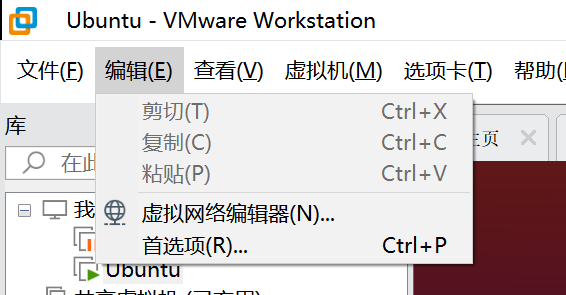

学习Linux是很痛苦的过程，不计其数的linux学习者前期开启虚拟机双系统，中期实体机Linux，但在后期投入了MacOS的怀抱或者回到了梦开始的地方--虚拟机。

虚拟机除了性能差点，其余可谓是和实体机没什么差别，但直接在虚拟机内操作可能体验感比较差，要不，我们用ssh远程连接虚拟机的终端吧！

<!-- more -->
## 1. 准备工作
详细的安装步骤略。我使用的是VMware Workstation Pro 16.0安装了Ubuntu 20.04LST  
默认虚拟机的网络适配器是`NAT`模式，因为学校的校园网登录需要认证，我就让它保持不变。  
然后就是要知道宿主机和虚拟机的ip地址  
### 宿主机 Windows 10
打开终端，我使用的终端是 `Windows Terminal`中的CMD。  
在终端中输入: `ipconfig`  
你会得到很多输出，比如，我现在使用的是无线网络，宿主机ip就在`无线局域网适配器 WLAN` 寻找:  
``` bash
无线局域网适配器 WLAN:

   连接特定的 DNS 后缀 . . . . . . . : pc.*.edu.cn
   本地链接 IPv6 地址. . . . . . . . : fe80::*:*:*:*%*
   IPv4 地址 . . . . . . . . . . . . : 10.*.*.*
   子网掩码  . . . . . . . . . . . . : 255.*.*.*
   默认网关. . . . . . . . . . . . . : 10.*.*.*
```
其中关键信息我手动用了*隐藏，宿主机的ip就是IPv4地址，即 `10.*.*.*`  
### 虚拟机 Ubuntu 20.04
打开终端，输入命令: `ifconfig`  
如果如图提示 `ifconfig not found`

就`sudo apt install net-tools`就好了，可以再次执行命令  
现在输出的是：
```bash
ens33: flags=4163<UP,BROADCAST,RUNNING,MULTICAST>  mtu 1500
        inet 192.*.*.*1  netmask 255.*.*.*  broadcast 192.*.*.*0
        inet6 fe80::*:*:*:*  prefixlen 64  scopeid 0x20<link>
        ether 00:*:*:*:*:bf  txqueuelen 1000  (Ethernet)
        RX packets 126965  bytes 189112092 (189.1 MB)
        RX errors 0  dropped 0  overruns 0  frame 0
        TX packets 51158  bytes 3164015 (3.1 MB)
        TX errors 0  dropped 0 overruns 0  carrier 0  collisions 0

lo:    flags=73<UP,LOOPBACK,RUNNING>  mtu 65536
        inet 127.0.0.1  netmask 255.0.0.0
        inet6 ::1  prefixlen 128  scopeid 0x10<host>
        loop  txqueuelen 1000  (Local Loopback)
        RX packets 519  bytes 46328 (46.3 KB)
        RX errors 0  dropped 0  overruns 0  frame 0
        TX packets 519  bytes 46328 (46.3 KB)
        TX errors 0  dropped 0 overruns 0  carrier 0  collisions 0
```
虚拟机的ip地址就是`ens33:inet`地址，即`192.*.*.*1`  
## 2. 建立IP映射
然后，我们需要将主机与宿主机的ip映射到一起。  

打开 编辑->虚拟网络编辑器，如图所示：  
  
然后选择**NAT模式**的连接，进入**NAT设置(S)**, 再点击**添加(A)**, 如图：  
  
弹出的**映射传入端口**中:  
- 主机端口，默认是22，
- 虚拟机ip地址，填写上面找到的虚拟机ip
- 虚拟机端口，默认22即可

通过上述步骤，我们就成功将 `{主机ip}:22` 与 `{虚拟机ip}:22` 映射到了一起。
## 3. 配置虚拟机SSH
- 安装openssh-client：`sudo apt install openssh-client`
- 安装openssh-server：`sudo apt install openssh-server`
- 启动ssh-server：`sudo /etc/init.d/ssh start`
- 确认ssh-server工作正常：`netstat -tpl`  
如果你看到了有`ssh`的字样，就说明ssh正在运行

至此，成功安装ssh，并且可以通过ssh工具在宿主机上使用。

如图所示：

比如，我使用`Windows Terminal`中的ssh工具  
直接在命令行输入:
`ssh {虚拟机用户名}@{虚拟机ip}`，然后坚持要访问  
等密码提示框出现时输入密码，就可以愉快远程访问啦！  

我们来执行一个很基础的命令：  
在控制台输出 `Hello World!`:


此文就到此结束啦！欢迎大家在评论区留言哦ヾ(^▽^*)))  
Ciallo～(∠・ω< )⌒☆​  
写文不易，如果你觉得我的文章对你有帮助，欢迎[打赏](https://arnold117.github.io/likes/)！)！