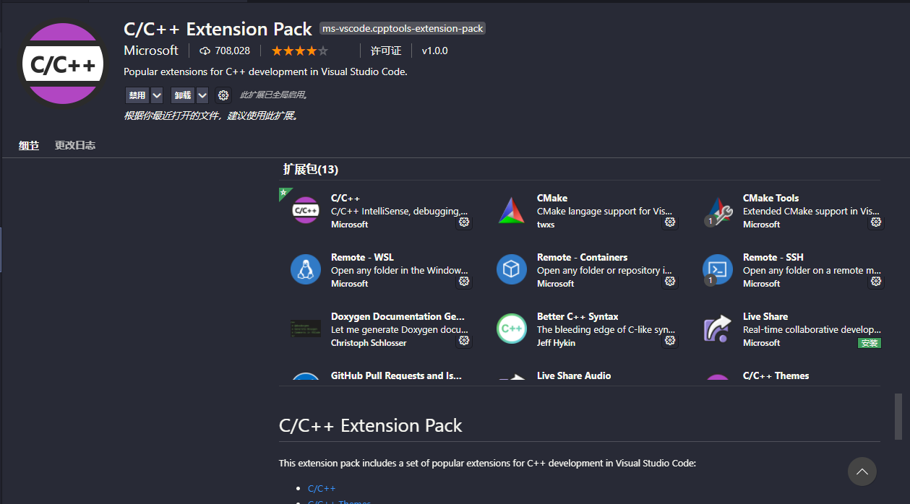

本文介绍了一种通过使用`CMake`和`VSCode`进行**全平台一致的C语言或C++的开发**的方法, 并在Windows操作系统下进行了验证.

<!-- more -->

为了使用C语言或者C++进行开发, 至少需要有**文本编辑器**, **编译器**, 如果有**调试器**就更好了.

`VSCode`本质上是一个**文本编辑器**, 但它有丰富的插件生态, 通过使用这些插件可以对C语言或C++程序进行调试.

**编译器和调试器**, 一般来讲, 这两个东西是成双成对的: 由`gcc`或`g++`编译的程序, 使用`gdb`进行调试; 由`clang`编译的程序使用`lldb`进行调试; 由`msvc`编译的程序用`msvc`进行调试.  
除了`msvc`, 上述编译器与调试器都是可以跨平台使用的, 即使在Windows上也可以通过`Mingw`实现`GCC`等的跨平台使用.  
这几种编译器和调试器占据了大部分市场, 根据平台, Linux下`GNU`的`gcc`、`g++`和`gdb`是主流; macOS下, `clang+lldb`是主流,使用`GNU`的也不能算少; Windows平台下比较复杂, 主要有两种: 一种是通过`Mingw`使用`gcc`; 另一种则是使用微软出品的~~宇宙最强IDE~~`Visual Studio`.

上面提到**全平台一致的C语言或C++的开发**, 但是不同编译器、调试器的使用方式并不相同. VSCode通过C/C++插件已经解决了调试器不同的问题; 而编译器的问题, 可以通过CMake, 一个通用的编译构建工具, 生成Makefile并编译来解决.
> CMake is an open-source, cross-platform family of tools designed to build, test and package software. CMake is used to control the software compilation process using simple platform and compiler independent configuration files, and generate native makefiles and workspaces that can be used in the compiler environment of your choice.

## 1. 所需工具
> a. 文本编辑器: Visual Studio Code  
> b. 编译器: gcc/g++ (Linux), clang (MacOS), Mingw-w64 (Windows)  
> c. 调试器: gdb (Linux), lldb (MacOs), Mingw-w64 (Windows)  
> d. 构建工具: CMake, Make.

## 2. 环境安装与配置
MacOS与Linux的安装与配置与Windows下类似, 在此就介绍在Windows下的安装与配置.
### 1) 下载并安装VSCode
前往[VSCode官网](https://code.visualstudio.com/)下载并安装.  
**注意!** 请选择系统安装包, 用户安装包安装好后有很多权限问题!!  
将页面滑倒最下方, 选择 **System installer**  

### 2) 安装VSCode插件
  
在右侧选择扩展, 搜索`C/C++ Extension Pack`, 然后安装  
  
这个扩展包含有13个插件, 完美包含了开发C语言或者C++所需, 日后可能都需要用上. 如果不想安装太多, 安装`C/C++`, `CMake`, `CMake Tools`, 即可.
### 3) 安装编译器和调试器
进入[Mingw-w64下载页面](https://sourceforge.net/projects/mingw-w64/files/mingw-w64/), 选择64位posix-seh的版本, 这里版本号选择`gcc-8.1.0`
  
将其解压到C盘根目录, 并将其添加到系统环境变量:  
`Win + S` 搜索框输入`env`, 进入系统环境变量编辑
  
选择环境变量,然后在系统变量里找到`Path`, 点击编辑, 在里面新建一条, 输入安装路径, 我这是`C:\mingw64\bin`  
  
这样, gcc的开发环境就配置好了. 建议重启一下, 然后打开`cmd`, 输入`gcc --version`验证安装  
如果出现如图类似界面, 则说明安装成功. 

### 4) 安装CMake
去[CMake官网下载页面](https://cmake.org/download/), 选择 `Windows X64 installer`  
  
将其安装在C盘根目录. 安装时记得勾选`Add CMake to the System PATH for all users`  
  
同样, 安装完成后进行验证, 在`cmd`内输入`cmake --version`  
  
出现如图字样就是安装成功.

## 3. 创建工程, 开始编程
### 1) 创建工程文件夹
在计算机上任意位置创建一个文件夹, 文件夹名称需要与工程名一致, 示例为`VSCodeCMake`, 用VScode打开它
### 2) 构建工程雏形
打开命令面板, 输入 `cmake`, 选择`CMake Quick Start`  
  
  
输入工程名, 需要与文件夹名对应.  
需要生成可执行文件的话, 要选择`executable`  
  
然后就会生成一些文件, 最主要的就是`CMakeList`和`main.cpp`  

### 3) 编程
关于CMake的语法和C语言的语法请先在网络上查询.
### 4) 运行与调试
编程完成后, 调试与运行的按钮在屏幕下方: 红色箭头所指的虫形标志就是调试(DEBUG), 旁边蓝色箭头所指就是运行  
在代码栏数字行标左侧点击, 就可以添加断点.  
  
调试的界面如图所示  
  
直接运行的话, 该程序会在控制台输出`Hello, World!`, 如图所示  

## 恭喜!
你已经完成了该章节学习, 一起进入C语言编程美丽世界吧!

此文就到此结束啦！欢迎大家在评论区留言哦ヾ(^▽^*)))  
Ciallo～(∠・ω< )⌒☆​  
写文不易，如果你觉得我的文章对你有帮助，欢迎[打赏](https://arnold117.github.io/likes/)！