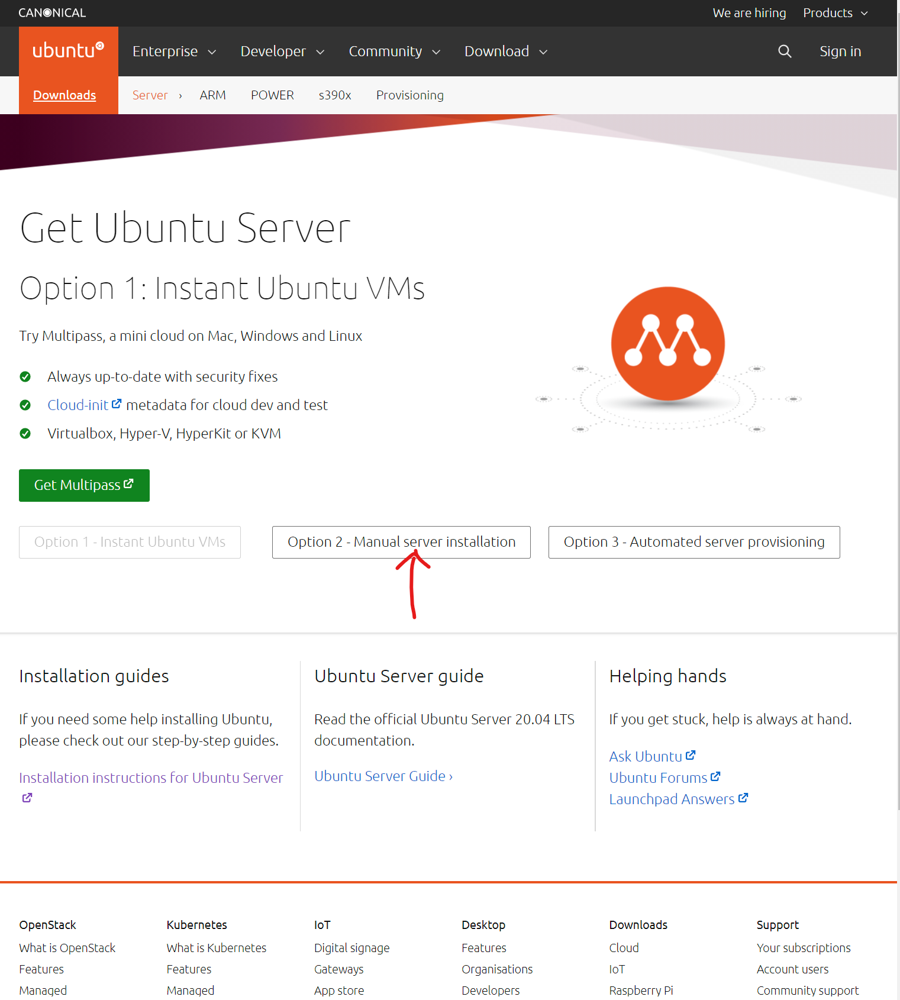
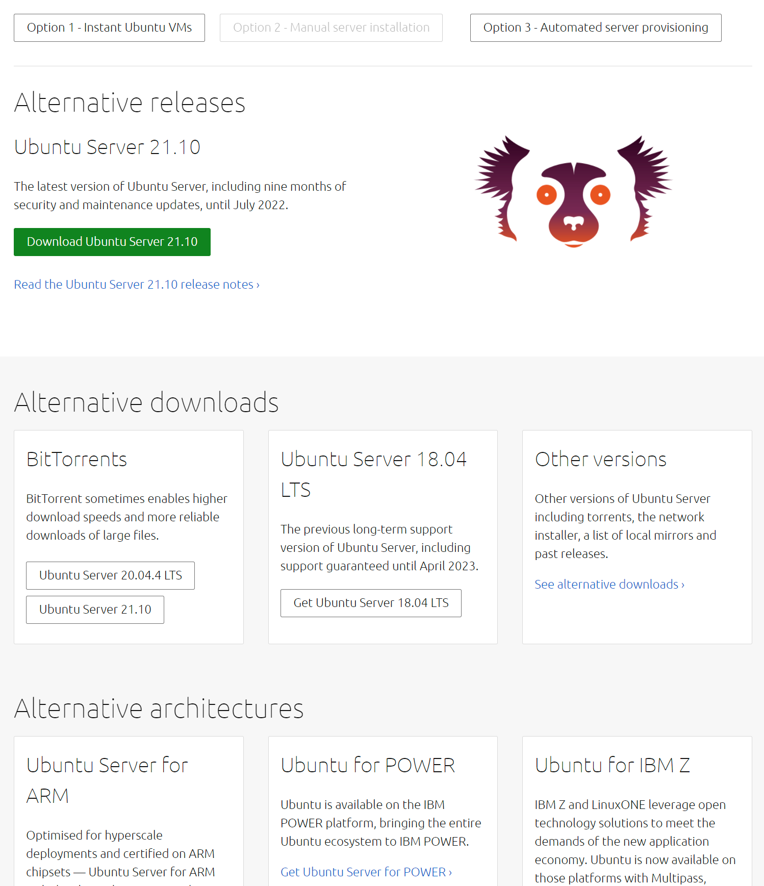
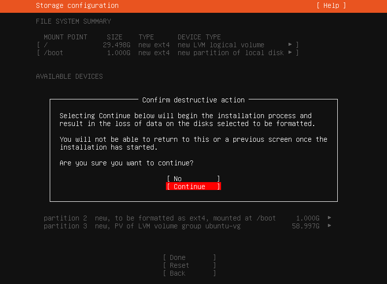
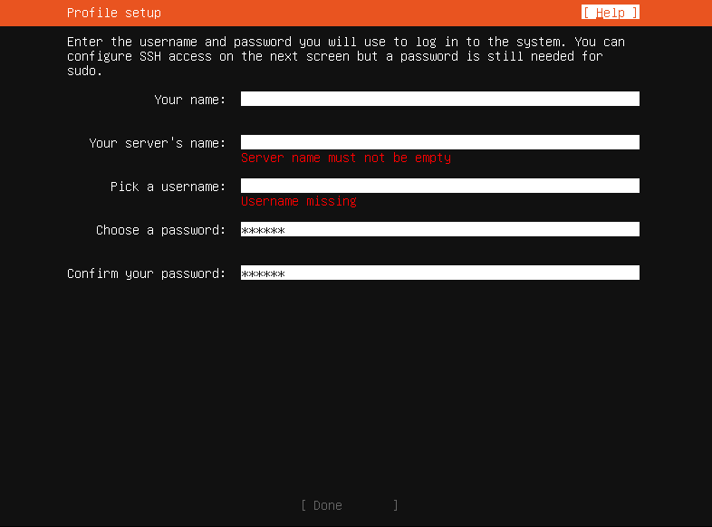

本文介绍了一种在VMware下安装Ubuntu Server 18.04 的方法。

<!-- more -->
大数据的路可太难走了，我用的大部分linux软件都已经适配Ubuntu 20.04了，但大数据相关的软件还没有，，，这不又得安装一下低版本？低版本比较新的是18.04，Hadoop的更新也表明支持该操作系统，就安装这个吧！

## 0. Ubuntu 和 Ubuntu Server的区别
emmm，其实本质上没什么区别，就是一个有图形界面，一个没有图形界面。  
我不习惯使用图形界面(都Linux了，不敲命令行？？？)，而且吧，服务器资源寸土寸金，装上图形界面系统负载就大了，为了运行效率和节约成本，一般不使用图形界面。

## 1. 准备工作
需要自行安装VMware，我使用的版本是 VMware Workstation 16 Pro，如果是同学想找我拷贝虚拟机镜像，建议安装同样的版本。

需要去Ubuntu官网的下载界面下载Ubuntu Server([点此访问！](https://ubuntu.com/download/server))

注意！它官网具有很大迷惑性！一定要选择**Option 2**才可以进入服务器下载界面！

进去以后往下滑，然后选择**Get Ubuntu Server 18.04 LTS**!

## 2. VMware 创建虚拟机
文件->新建虚拟机

这里我选择典型安装：

在这一步，建议选择稍后安装系统，不然你体会不到安装系统的乐趣(bushi)  
主要是，以后安装就是实体安装了，可没有快速安装这个选项！

随后的一步，选择Linux和Ubuntu 64位操作系统

名称自己定，这个无所谓的。然后指定磁盘容量，这里磁盘大小请保证为**50GB以上**，因为大数据要用的软件都比较大，还比较多！！同时，为了性能，请选择**储存为单个文件**

硬件配置就看自己电脑咯，推荐配置就够用了其实，不够自己随时调整一下就行！点完成，就创建好了！

## 3. 虚拟机上安装Ubuntu Server 18.04
首先，要编辑虚拟机设置，把安装镜像磁盘加入到虚拟光驱

完成后，我们开启虚拟机，等待一堆启动检测。然后我们就可以看到这个界面：

没有中文，我在此选择English，当然你要是点亮了其他语言天赋，欢迎尝试(笑

直接下一步就行，不用更新

键盘布局，网络设置，和网络代理，按个人来。我这里保持默认。

我把镜像的地址设为了阿里云镜像(http://mirrors.aliyun.com/ubuntu)，这样软件包的安装会快一些。

分区啥的，我也保持默认了。有需要自己调整一下。然后就是，毁灭性操作！其实就是安装啦，

填写机器的名称和用户名，一定要记住啦！

我使用远程终端连接，所以我要安装OpenSSH server，方便我使用WindowsTerminal等，我选择从GitHub上导入我已经有的SSH身份，这样我在主系统使用ssh连接也没什么问题啦！那个，不用其实也是可以的，只是这样对我来说方便一点。不怎么用GitHub的话，就别弄了。但OpenSSH最好还是装上！后面Hadoop集群运算还是要的！

然后它会推荐一堆包，按需求安装。我这里暂时是用不到这些，就不安装了。

等待，如果界面弹出这样的，就说明安装好了！然后重启进入系统！

这个输密码是不显示的，不要以为没输进去，输完回车就好。安装完成！欸嘿嘿~

然后按照我先前博客的方式配置ssh([点我访问！](https://arnold117.github.io/vmware_ssh/))，就可以在terminal下面连接ubuntu了，还是很方便的感觉。

接下来继续捣鼓Hadoop的安装与配置吧！

此文就到此结束啦！欢迎大家在评论区留言哦ヾ(^▽^*)))  
Ciallo～(∠・ω< )⌒☆​  
写文不易，如果你觉得我的文章对你有帮助，欢迎[打赏](https://arnold117.github.io/likes/)！