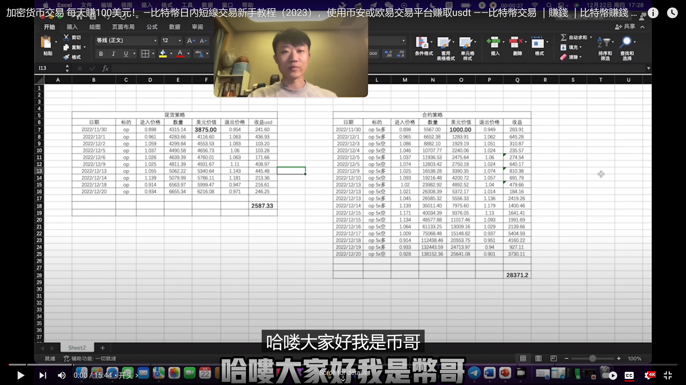
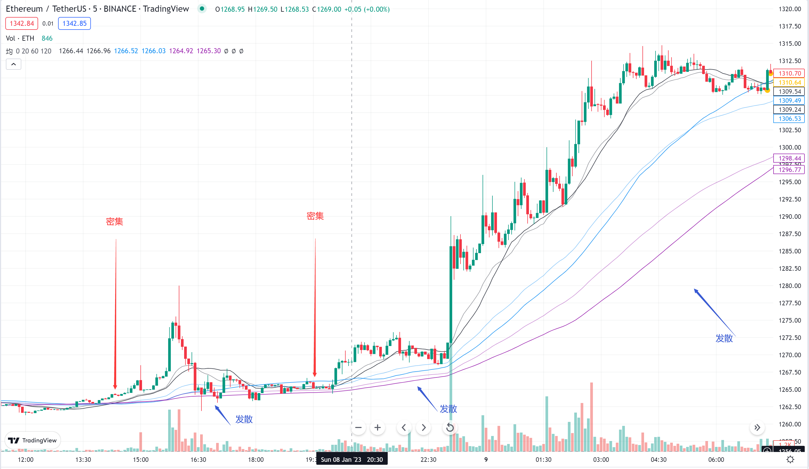

该文内展示的代码和操作指示源于[以太坊教授币哥](https://www.youtube.com/@user-nr1zq4oh1x)的[视频](https://www.youtube.com/watch?v=FtN6beIbtp8&t=226s)。  

<!-- more -->

该位Up，发布视频称视频发布日期前三周利用均线交易策略交易现货10笔，获利2587美元；和交易合约19笔，获利28371美元。

在接下来的视频中他分享了他使用的交易策略。视频中的代码和操作指示是基于TradingView平台的。本文将对该视频中的代码进行解释，给出操作指示，并提示其风险。

## 1. Up提示
该Up在视频中给出了一些提示，如下：
> 1. 该套交易系统不需要学习任何技术分析
> 2. 需要使用到图表工具，如TradingView
> 3. 需要专用的交易账户，需要与投资账户独立，不可混用
> 4. Up非财务顾问，交易前需要了解你在做什么，**并对自己的操作负责**

**本文作者提醒**：在进行交易前还是应当了解基本的**技术分析知识**，并熟悉**各类交易操作**。**投资有风险，操作需谨慎**。  
推荐使用Binance和Okx交易平台进行交易。如果你还没有交易账户，欢迎使用下方的邀请码注册账户，通过邀请码注册的账户将获得**一定比例的交易手续费减免**，这可以减少交易摩擦和减少投资成本，对我们的投资很有帮助。  
Binace：邀请码V45k8IDM，[https://accounts.binance.com/en/register?ref=V45K8IDM](https://accounts.binance.com/en/register?ref=V45K8IDM)  
OKx：邀请码10604018，[https://www.cnouyi.care/join/10604018](https://www.cnouyi.care/join/10604018)  

**本文作者提醒**：不是所有人都适合做交易，因为做交易会让你的情绪和过山车一样，并会产生很大的压力。做交易前还请有清晰的**仓位管理**和**止盈止损**计划，**不要动用所有本金或者大资金进行交易**。

## 2. 代码解释
他给出的代码是：
```
//@version=4
study(title="均线系统", shorttitle="均", overlay = true )
sma20 = sma(close,20)
sma60 = sma(close,60)
sma120 = sma(close,120)

ema20 = ema(close,20)
ema60 = ema(close,60)
ema120 = ema(close,120)

plot(sma20,color=color.black,title="SMA20")
plot(ema20,color=color.new(color.black,50),title="EMA20")

plot(sma60,color=color.blue,title="SMA60")
plot(ema60,color=color.new(color.blue,50),title="EMA60")

plot(sma120,color=color.purple,title="SMA120")
plot(ema120,color=color.new(color.purple,50),title="EMA120")

cond=barstate.islast
bl=low
moveBar = input(0)
x20=input(20)+moveBar
x60=input(60)+moveBar
x120=input(120)+moveBar
plot(cond?bl[20]:na,color=#FFC40C,linewidth=5,offset=-x20,style=plot.style_circles,transp=0)
plot(cond?bl[60]:na,color=#FFC40C,linewidth=5,offset=-x60,style=plot.style_circles,transp=0)
plot(cond?bl[120]:na,color=#FFC40C,linewidth=5,offset=-x120,style=plot.style_circles,transp=0)
```
按照上述代码画出来的图为：


我们可以看出，这个代码用到了SMA和EMA两类指标，和其对应的抵扣价。各类指标的含义和计算方法在此不做说明。  

其中，黑线为SMA20，<font color=blue>蓝线</font>为SMA60，<font color=purple>紫线</font>为SMA120。EMA线段的颜色为对应的SMA线段颜色的半透明。在此视频中，关于抵扣价并未提及，故本文不做过多说明。

故可知，使用该策略的交易者不一定需要使用TradingView，在自己熟悉的图表工具上自行标注SMA(20,60,120)和EMA(20,60,120)即可。需要注意的是，不同图表工具上，关于SMA的称呼并不一致，有些亦称其为MA。即：**SMA和MA是等价的**。

## 3. 操作指示
### a. 将代码复制到TradingView上
将上述代码复制到TradingView的`Pine Editor`，即可看到上文所示的带有指标的图表。

其中，黑线为SMA20，<font color=blue>蓝线</font>为SMA60，<font color=purple>紫线</font>为SMA120。EMA线段的颜色为对应的SMA线段颜色的半透明。  
本文称黑线为快线，<font color=blue>蓝线</font>为中线，<font color=purple>紫线</font>为慢线。

亦可以在图表工具上自行标注SMA(20,60,120)和EMA(20,60,120)，如本文作者使用AiCoin，标注效果如图：


### b. 重要概念
如图所示，当均线在一定时间内聚集在一起，像一股绳子拧在一起一样，即为均线密集；当均线在一定时间内发散开来时，即为均线发散。

当均线密集时，表示市场处于震荡状态，此时不适合做多或做空。当均线发散时，表示市场处于趋势状态，此时适合做多或做空。

当快线高于中线高于慢线时，说明行情处于上涨趋势；当快线低于中线低于慢线时，说明行情处于下跌趋势。

### c. 交易信号
出现均线密集，随后K线跌破均线密集，则认为有可能有下跌趋势，卖出现货或者做空。

出现均线密集，随后K线突破均线密集，则认为有可能有上涨趋势，买入现货或者做多。


### d. 交易建议
仅选取**本金10%以下**资金进行交易，以免出现大额亏损。**开仓时**设置**止盈止损**，5min图上止盈**3-5%**，止损**1-2%**；15min图上止盈**5-8%**，止损**2-3%**；1h图上止盈**8-10%**，止损**3-5%**。  
另，止盈点位亦可以设置为**上一均线密集处**。

高倍杠杆可以带来可观收益，但是**高收益对应着高风险**，故**不要使用高倍杠杆**，杠杆倍数不宜高过**5倍**。最好开日内单，**不要留过夜单**。  
**上述仅为交易建议，开仓资金和止盈止损请按照实际情况自行调整**

## 4. 风险提示
**本文作者提醒**：在进行交易前应当了解基本的**技术分析知识**，并熟悉**各类交易操作**。**投资有风险，操作需谨慎**。  

**本文作者提醒**：不是所有人都适合做交易，因为做交易会让你的情绪和过山车一样，并会产生很大的压力。做交易前还请有清晰的**仓位管理**和**止盈止损**计划，**不要动用所有本金或者大资金进行交易**。

在这个视频中并未有提及到运行时的**止损**，**胜率**，和**回撤**，仅列出了盈利的部分，故对其真实收益存疑，**请谨慎操作**。

均线的产生具有一定的时间延迟，需要配合K线图和其他指标进行分析，**最好不要单独使用均线**。

真实的交易环境中，信息也会很大程度影响市场。如交易者收到了极其不利于市场的信息，即使K线图和各指标表现再好，行情很有可能会发生一个突然下跌。故在实际交易中不但要分析**图表**，还要积极**获取信息**并**分析信息**。

交易时，应保持互联网连接**稳定**和**低延迟**，不稳定的互联网连接过高的延迟可能导致**交易失败**，甚至**造成亏损**。

此文就到此结束啦！欢迎大家在评论区留言哦ヾ(^▽^*)))  
Ciallo～(∠・ω< )⌒☆​  
写文不易，如果你觉得我的文章对你有帮助，欢迎[打赏](https://arnold117.github.io/likes/)！