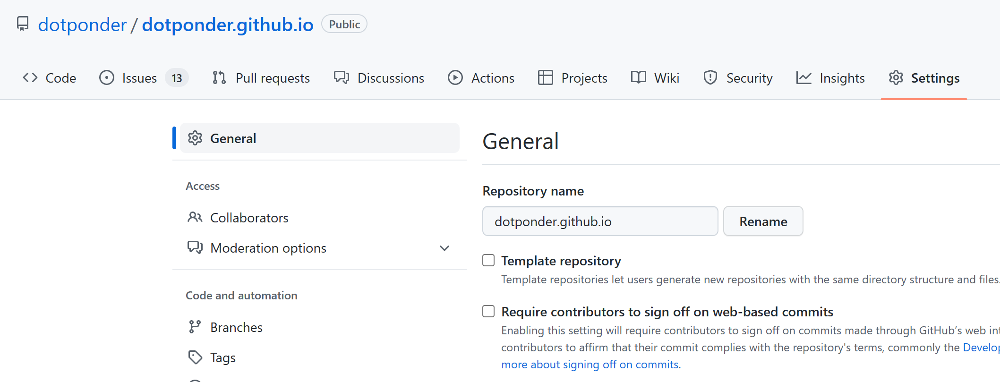
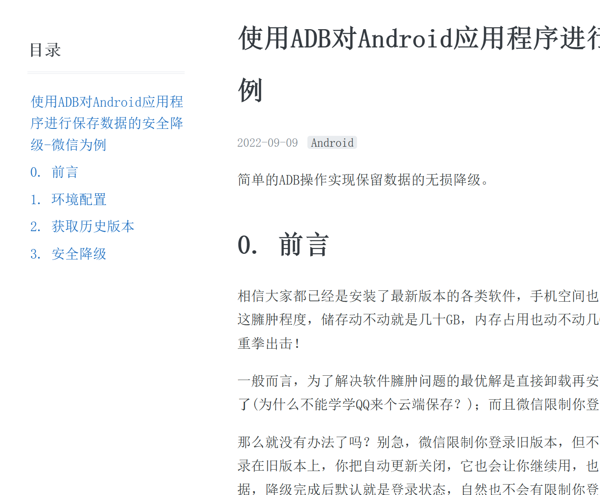

作为一个程序员怎么能没有自己的个人博客呢，这里详细记录和分享我的博客搭建经验，让你轻轻松松拥有自己的博客网站。傻瓜式一站式教你用 github pages 来搭建博客，详细记录全过程，保证你能学会。

如果你是非程序员或者不关系技术细节，只需花 3 分钟阅读前面 5 个章节内容，就能轻松拥有自己的博客。

<!-- more -->

## 开始

话不多说，直接上图先来看下我的博客整体效果，个人比较喜欢这种简约的博客风格，不要花里胡哨但该有的功也都有。


下面列举这个博客具有的功能特性，其中我比较看重归档和搜索能力。

### 支持特性

- 简约风格博客

- Powered By Jekyll

- 博客文章搜索

- 自定义社交链接

- 网站访客统计

- ~~Google Analytics 网站分析~~

- Gitalk评论功能

- 自定义关于about页面

- 支持中文布局

- 支持归档与标签

- 支持改变主题颜色

- 支持添加文章目录

  

## 建立博客Git仓库

首先你要在[github](https://github.com/)上有自己博客仓库，用来生成和存放博客文章。你可以直接fork我的博客仓库。这样你马上有了自己的博客仓库。

[点这里我的博客地址](https://github.com/arnold117/arnold117.github.io)进去点击 fork，之后在你自己的仓库下会看到刚复制的仓库，以后的操作都在你自己的仓库进行，当然想感谢我写这个教程就帮我点个**start**吧！


**版权声明： fork之后_posts文件夹内容是我的博客文章，版权归我所有。你可以选择删除里面的文章替换上自己的博客文章，如需转载需要与我联系授权**。


## 修改博客仓库名称

进到你自己的博客仓库，**修改博客仓库名称成你自己的用户名**。因为 github page 解析的时候找的是这个 username.github.io的仓库名，**这一步非常重要**。



此时，不出意外的话，打开域名 https://username.github.io 就能看到你刚搭建的博客了。*注意替换 username成你自己的github 用户名*。

## 博客配置

上面点开域名看到的还是我的博客配置，显示的博客名字也是我的。还需要更改配置才是你的博客。

博客的配置文件是仓库根目录下的_config.yml文件，直接点开它编辑。


你还需要更改以下配置：

### 博客名称和描述


分别是博客名称和描述，自己任意写点啥。

### 博客社交链接


这里配置社交链接按钮，没配的不显示，我现在配了知乎、邮箱、github账号、推特这几个。其他你想加自己加上就可以。

###  配置gitalk

这个是评论功能的配置。评论功能基于gitalk，在配置文件中找到gitalk配置项目：

修改规则如下：

```yml
gitalk:
  clientID: <你的clientID>
  clientSecret: <你的clientSecret>
  repo: <你的repository名称>
  owner: <你的GitHub用户名>
```

原理是利用github的issues评论文章。其中clientID和clientSecret需要[点击这里创建](https://github.com/settings/applications/new)


点绿色按钮创建，成功之后会得到以上两个id，修改配置即可。

### Google站长统计

**NOTE** 该部分功能出错，调试中。

### 博客网址配置

```
# Your website URL (e.g. http://barryclark.github.io or http://www.barryclark.co)
# Used for Sitemap.xml and your RSS feed
url: https://yourname.github.io
```

这里配置你自己的博客地址。

### 配置提交

对_config.ymld的修改需要提交才能生效，点下图中绿色按钮提交。


**done! 现在输入上面提到的博客地址，回车，你拥有了自己的博客。**


## 如何写博客

好了，博客有了。如何更新文章呢？

文章用markdown语法，写好统一放在_post文件夹下上传，git page会自动从你的git仓库拉去解析成网页，立刻就能在你的博客网页浏览。

关于文章的**命名格式**：博客文章必须按照统一的命名格式 `yyyy-mm-dd-blogName.md` 比如我这篇博客的名字是`2023-01-11-github_pages.md`

**看到这里，如果只是简单的想写博客，后面的不看也可以了，你已经拥有了自己的博客！后面章节是记录一些DIY的过程。**

## 搜索功能集成

博客模板本来是没有搜索功能的，搜索功能依赖[Simple-Jekyll-Search](https://github.com/christian-fei/Simple-Jekyll-Search)提供支持。

### 配置search.json

[复制这份代码到你博客的根目录](https://github.com/christian-fei/Simple-Jekyll-Search/blob/master/example/search.json)

这个配置文件代表可以按博客的标题、标签、时间、分类搜索。

### 下载simple-jekyll-searchj文件

[下载这整个文件夹](https://github.com/christian-fei/Simple-Jekyll-Search/tree/master/example/js)，里面包含simple-jekyll-search.min.js和simple-jekyll-search.js两个文件，连同js文件夹放在你的根目录下面。

### 配置搜索框标签

在你想展示搜索框的页面我的是index.html，这个页面和每个人的博客模板有关，可能需要一点前端知识，添加如下的html标签。

```html
<div class="search-container">
  <input type="text" id="search-input" placeholder="search blog posts...">
  <ul id="results-container"></ul>
</div>

<!--script src="https://unpkg.com/simple-jekyll-search/dest/simple-jekyll-search.min.js"></script-->
<script src="{{ site.baseurl }}/js/simple-jekyll-search.min.js"></script>

<script>
	window.simpleJekyllSearch = new SimpleJekyllSearch({
	searchInput: document.getElementById('search-input'),
	resultsContainer: document.getElementById('results-container'),
	json: '{{ site.baseurl }}/search.json',
	searchResultTemplate: '<li><a href="{url}?query={query}" title="{desc}">{title}</a></li>',
	noResultsText: 'No results found',
	limit: 10,
	fuzzy: false,
	exclude: ['Welcome']
  })
</script>
```

其中，以下两个是二选一的，一个是用云端的js一个是用本地的js如果本地有的话。

`<script src="https://unpkg.com/simple-jekyll-search/dest/simple-jekyll-search.min.js"></script--> `

`<script src="{{ site.baseurl }}/js/simple-jekyll-search.min.js"></script>`

配置完成，打开博客，你得到这样一个搜索框。


## 搜索框样式

搜索框的样式是可以改变的，这里有修改HTML中CSS样式的方法，我搞后端的，前端现学现卖。

[html插入标签样式方法](https://blog.csdn.net/u014103733/article/details/72961366)


## 社交链接

模板提供的链接没有知乎链接，或者你想增加自定义的链接，都可以通过以下方法添加。以增加zhihu链接为例

链接的图片是svg格式的(我也刚知道)，大概了解一下什么是svg和viewBox

[viewBox](https://developer.mozilla.org/zh-CN/docs/Web/SVG/Attribute/viewBox)

> viewBox属性的值是一个包含4个参数的列表 `min-x`, `min-y`, `width` and `height`， 以空格或者逗号分隔开， 在用户空间中指定一个矩形区域映射到给定的元素,查看属性 
[深入简出 SVG 教程](https://zhuanlan.zhihu.com/p/36138381)

### 配置_config.yml

```yml
footer-links:
  weibo: yourname #请输入你的微博个性域名 https://www.weibo.com/<yourname>
  zhihu: yourname #输入你知乎主页链接上的名字 https://https://www.zhihu.com/people/<yourname>
```

### 修改svg-icons.html

因为footer.html中调用了svg-icons.html来生成社交链接。

可见是先调用了svg-icon.html显示社交链接，所以修改_include/svg-icons.html增加zhihu链接

```html

  <li><a href="https://zhihu.com/people/{{ site.footer-links.zhihu }}" class="icon-2 zhihu" title="ZhiHu"><svg viewBox="0 0 600 600"><path d="M170.54 148.13v217.54l23.43.01 7.71 26.37 42.01-26.37h49.53V148.13H170.54zm97.75 193.93h-27.94l-27.9 17.51-5.08-17.47-11.9-.04V171.75h72.82v170.31zm-118.46-94.39H97.5c1.74-27.1 2.2-51.59 2.2-73.46h51.16s1.97-22.56-8.58-22.31h-88.5c3.49-13.12 7.87-26.66 13.12-40.67 0 0-24.07 0-32.27 21.57-3.39 8.9-13.21 43.14-30.7 78.12 5.89-.64 25.37-1.18 36.84-22.21 2.11-5.89 2.51-6.66 5.14-14.53h28.87c0 10.5-1.2 66.88-1.68 73.44H20.83c-11.74 0-15.56 23.62-15.56 23.62h65.58C66.45 321.1 42.83 363.12 0 396.34c20.49 5.85 40.91-.93 51-9.9 0 0 22.98-20.9 35.59-69.25l53.96 64.94s7.91-26.89-1.24-39.99c-7.58-8.92-28.06-33.06-36.79-41.81L87.9 311.95c4.36-13.98 6.99-27.55 7.87-40.67h61.65s-.09-23.62-7.59-23.62v.01zm412.02-1.6c20.83-25.64 44.98-58.57 44.98-58.57s-18.65-14.8-27.38-4.06c-6 8.15-36.83 48.2-36.83 48.2l19.23 14.43zm-150.09-59.09c-9.01-8.25-25.91 2.13-25.91 2.13s39.52 55.04 41.12 57.45l19.46-13.73s-25.67-37.61-34.66-45.86h-.01zM640 258.35c-19.78 0-130.91.93-131.06.93v-101c4.81 0 12.42-.4 22.85-1.2 40.88-2.41 70.13-4 87.77-4.81 0 0 12.22-27.19-.59-33.44-3.07-1.18-23.17 4.58-23.17 4.58s-165.22 16.49-232.36 18.05c1.6 8.82 7.62 17.08 15.78 19.55 13.31 3.48 22.69 1.7 49.15.89 24.83-1.6 43.68-2.43 56.51-2.43v99.81H351.41s2.82 22.31 25.51 22.85h107.94v70.92c0 13.97-11.19 21.99-24.48 21.12-14.08.11-26.08-1.15-41.69-1.81 1.99 3.97 6.33 14.39 19.31 21.84 9.88 4.81 16.17 6.57 26.02 6.57 29.56 0 45.67-17.28 44.89-45.31v-73.32h122.36c9.68 0 8.7-23.78 8.7-23.78l.03-.01z"/></svg><!--[if lt IE 9]><em>YouTube</em><![endif]--></a></li>
  
```

上面配置内容应该都能理解，`viewBox` 指定图片大小。

主要是`path d=` 内容的获取，这里其实是指定svg图片的内容，我们可以从 [这里](https://raw.githubusercontent.com/FortAwesome/Font-Awesome/master/svgs/brands/)获取到大部分svg素材，比如知乎的svg[在这](https://github.com/FortAwesome/Font-Awesome/blob/master/svgs/brands/zhihu.svg)，点`raw` 按钮查看源文件，复制`path d=`后面的内容到上面的配置即可。


## 添加网站计数

网站统计[由不蒜子](http://busuanzi.ibruce.info/)提供支持，就是可以统计网站当前访问次数和人数。配置也非常简单，[官方指引](http://ibruce.info/2015/04/04/busuanzi/#more)在这里。

### 修改页面html

想让统计显示在哪个页面，需要修改那个页面的html，增加如下内容：

```html
<!--不算子网站访客统计-->
<script async src="//busuanzi.ibruce.info/busuanzi/2.3/busuanzi.pure.mini.js">
</script>
<!-- pv的方式，单个用户连续点击n篇文章，记录n次访问量 -->
<div align="center">
	<span id="busuanzi_container_site_pv" style="font-family:Consolas;color:Silver;font-size:12px;">
		View:<span id="busuanzi_value_site_pv" style="font-family:Consolas;color:Silver;font-size:12px;"></span>
	</span>
	<!-- uv的方式，单个用户连续点击n篇文章，只记录1次访客数 -->
	<span id="busuanzi_container_site_uv" style="font-family:Consolas;color:Silver;font-size:12px;">
		User:<span id="busuanzi_value_site_uv" style="font-family:Consolas;color:Silver;font-size:12px;"></span>
	</span>
</div>
```

### style标签说明

可以通过style标签改变字体颜色与大小。具体参考:[html颜色表](http://xh.5156edu.com/page/z1015m9220j18754.html)和[html style属性](https://www.geeksforgeeks.org/html-style-attribute/)

eg.  `style="font-family:arial;color:Gainsboro;font-size:10px; text-align:right;width:200px;background-color:gray;`

## 修改博客主题颜色

博客使用开源的颜色表[Open Color](https://yeun.github.io/open-color/)，博客主题的可选颜色有：

`red, pink, grape, violet, indigo, blue, cyan, teal, green, lime, yellow`

修改文件`_sass/_variables.scss`，将文件中当前颜色，比如当前是 `grape` 全部替换成你想要的颜色即可。

## 显示文章目录

在文章开头信息中心增加 `toc: true` 描述即可打开文章目录显示。效果如下：



## 其他功能

[小功能](https://blog.csdn.net/ds19991999/article/details/81293467)

## 网站结构

根目录的index.html生成blog首页

_include/footer.html生成侧边栏

_include/svg-icons.html生成社交头像的链接

## 致谢

感谢 [Jekyll](https://www.jekyll.com.cn/) 提供的技术支持才能有这个博客。

感谢 [lemonchann](https://github.com/lemonchann/)提供的原始模板，在其上进行博客的Post。


此文就到此结束啦！欢迎大家在评论区留言哦ヾ(^▽^*)))  
Ciallo～(∠・ω< )⌒☆​  
写文不易，如果你觉得我的文章对你有帮助，欢迎[打赏](https://arnold117.github.io/likes/)！