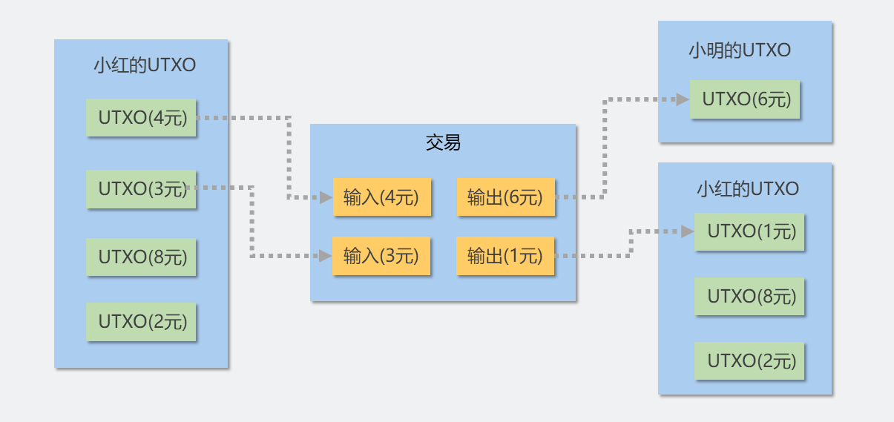

希腊在引入货币之后，很快就迎来了艺术、哲学、文学、建筑、天文、数学和民主等文化繁荣。或是模仿，或是独立发明，货币在世界范围内流行起来。与此同时，德国哲学家卡尔·雅斯贝尔斯（Karl Jaspers）提出的“轴心时代”（the Axial Age）也拉开了序幕。在轴心时代，“人类的精神基石同时分别在中国、印度、波斯、朱迪亚（Judea）和希腊奠定。时至今日，它们仍然是人类赖以生存的基础”。人类头脑中长期沉睡的一部分似乎突然因货币的到来苏醒了。

——人类货币史, David Orrell

## 比特币价值的起源

货币是一种基于**信任**的**社会共识**。为什么我们愿意用自己的劳动去交换美元、欧元和英镑作为报酬？因为每一个参与交换的人对纸币有着相同的认识：我们**相信**别人也愿意接受纸币**交换**自己的劳动，因此可以通过纸币为中介取得我们需要的产品和服务。传统货币的社会共识由**国家**创造，交换的参与者对货币的信心依靠国家的信用和强制力为枢纽，因此**传统的货币依赖于国家作为信任中心**。

货币的根本特性是**交换**。*交换*本身就是一种需求，而且是**最重要的需求**之一。如果不进行交换，就无法获得他人生产的经济产品，也就无法形成劳动分工。比特币不依赖信任中心，也无法依靠任何强制手段迫使别人接受比特币。比特币之所以可以作为交换媒介，是因为有足够多的人**认可**这种媒介，它的价值取决于背后的**实际交换需求**。

与纸币或者中心化支付相比，比特币有若干独特的技术性质，这使得比特币面世后不久就被其潜在的用户群体接受。另一方面，随着越来越多的人接受和使用，比特币的价值以及它代表的分布式信任网络也随着使用群体的扩大而强化。比特币作为一种交易媒介，至少有以下几个技术特点：

1. **交易媒介** 交易媒介应该具有以下三个要素，这是一种实体作为交易物需要满足的最低要求：(1) 只有**资产所有者**能动用**自己的**交易物；(2) 资产所有者**不能随意修改**自己交易物的数目；(3) 同一份交易物**不能使用两遍**。对于有物理实体的货币或贵金属，交易媒介的特性通过其**物理性质**实现。对于中心化的记账交易，例如PayPal，交易媒介的特性通过中心机构的**信用**担保。比特币使用密码学算法把一段**数据**变成交易媒介，**不依赖**任何物理实体或第三方。
2. **去中心化** 去中心化是比特币的**最重要**和**最根本**特性。比特币交易信息的**验证和存储**由分布在**世界各地**的计算机进行，这些计算机由矿池、金融机构、和普通爱好者运行。参与比特币存储和运行的计算机可以通过互联网，甚至专用的比特币卫星相互连接。**没有**任何组织或国家可以**完全监管和控制**比特币。
3. **便于流通** 与纸币或者贵金属相比，比特币不存在物理实体，可以方便地**通过网络流通**。与依赖中心化设施的金融机构相比，比特币**转账手续费比较低**，**速度更快**，并且**免于**繁琐规章制度的**监管**。
4. **半匿名性** 比特币的**交易是公开的**，但是比特币地址的**归属是匿名的**。**任何人**都可以生成比特币地址接收转账，并且比特币地址**不会与现实身份相关联**。

以上特性决定了比特币是一种**可靠的**、**不受单一实体控制**的**交换媒介**。因此，比特币作为一种去中心化和半匿名的交换媒介，可以满足相当一部分交易需求：资本被严格管制的国家的居民通过比特币转移资本，**规避管制**；金融秩序崩溃的国家的居民利用比特币作为**本地货币替代品**；地下交易通过比特币**洗钱**和**隐匿资金**等等。可以说特殊的交换需求形成了比特币的市场，这些市场的参与者形成了对比特币价值的初步共识。

比特币不以贵金属或国家信用作为担保，比特币的信用来自**分布式的信任模型**。分布式信任模型是一个由所有参与者构成的**交易网络**，其可信程度**随着参与者的增多而增强**。在建立了最初的共识之后，随着越来越多的政府、金融机构、企业参与到比特币的交易网络中，比特币的分布式信任也在不断强化。

继续讨论比特币价值的起源已经超出了本文的范围。不妨把比特币的特性作为一条公理接受下来：加密货币被社会承认的**必要条件**是满足**交易媒介的三个要素**和**去中心化**。本文接下来从技术角度，讨论如何构造一个系统，满足以上四条特性。

## 区块链概述
比特币本质是一个分布式账本，每个参与比特币交易的计算机上都有一份账本的拷贝。比特币通过一系列复杂的机制，保证每个计算机上的**账本内容一致**并且参与者**无法私自篡改**。在2021年初，这个账本的大小大约为**317 GB**。

参与比特币交易的计算机主要通过互联网通信，这些计算机也叫做**比特币节点**。新加入的比特币节点会试着与其它已知的节点相连接，一旦成功建立连接，新节点会下载整个“比特币的账本”。账本下载好之后，这个节点就成为比特币网络的一部分，可以进行交易了。

比特币交易可以概括为三件事：(1) 发起新的交易；(2) 验证其他人的交易的有效性；(3) 把交易写进账本。如果一个比特币节点要给其它节点转账，它会生成一段交易数据，然后把交易数据向其它节点发送。收到数据的节点会验证交易的有效性，如果有效就把这段数据继续转发给其它节点，短时间内，交易信息像洪水一样传遍**整个比特币网络**。

比特币网络有一些特殊的节点，称为**矿工**，矿工能够把有效的交易信息写进自己的账本。矿工一旦把交易写进自己的账本，就会把更新后的账目向其它节点发送。其它节点会验证收到的账目，如果无误，收到帐的节点就会把矿工发来的信息写进自己的账本，并继续向接下来的节点转发。等到比特币网络中 *大多数* 的节点更新了自己的账本，一次交易就完成了。

比起在集中式系统上记账，在分布式系统上记账要复杂得多：不仅要防止账本被篡改，还要保证每个节点上账本的一致。总结起来，比特币使用的账本有以下几点非常特殊：

1. 比特币账本是分布式的，每一个运行比特币程序的节点都有一个账本的拷贝；
2. 只能查询和添加新的交易记录，不能修改和删除。每积攒若干条交易记录，这些记录就会被校验并且写入账本。新增的记录和校验信息，叫做一个区块 *block*；
3. 多个节点同时写入记录会导致写入冲突。为了避免写入冲突，比特币使用了某种特殊的算法，称为工作量证明(*Proof of Work*, *PoW*)，确保同一时刻全网只有一个节点能够写账本。
4. 为了防止账本的拷贝被恶意节点篡改，比特币用密码学算法对数据库进行校验，任何私自对账本的修改都不会被其它节点承认；
5. 为了保证账本的一致性，比特币使用了一种叫做共识的算法，确保大多数节点都接受同一份账本。

满足以上几点的分布式账本就是区块链，从2009年比特币问世以来，每一笔比特币的交易都记录在区块链上。接下来说明分布式账本的记账方法。

## 记账方法
### 账户模型
要理解分布式账本，即区块链，的工作方式，首先要说明这个账本的记账方法。比特币的记账方法和日常的记账非常不同，

日常记账以账户为基本单位，账本记录账户里的余额。假设现在有两人小红和小明，小红要给小明转账，一次简单的转账过程记录如下：
1. 小红开设了一个账户，收到5次转账，每次转账的金额是3元，4元，3元，8元，2元。现在小红的账户里有初始资金20元；
2. 小红给小明转账5元，账户余额15元；
3. 小红给小明转账6元，账户余额9元；

可以看出，这种记账方法以账户为基本单位，跟踪账户内的余额变动，因此叫做*账户模型(Account Model)*。在账户模型里，收到的钱“混合”在一起，当需要支出时，不会也没有必要区分支出的钱来自之前的哪一笔收入。

在上面的例子里，小红给小明转账5元之前，只要知道自己的账户里有20元余额就够了。小红不必记录她转给小明的5元，来自于之前5笔收帐中的哪一笔收入。

### UTXO模型
比特币的记账方法与上述方法不同，使用比特币支出的每一笔金额，必须明确指出这笔支出来自之前的哪一笔收入。在这个例子中，如果小红要给小明转账5元，必须指出这次支出来自之前的两笔收入(3元+2元)。如果不想凑整，也可以让选择的收帐大于转账的金额，再让对方找零(3元+4元+找零2元)。用比特币的记账方式描述小红给小明的转账过程如下：
1. 小红开设了一个账户，收到5次转账，每次转账的金额是3元，4元，3元，8元，2元。现在小红的账户里有20元；
2. 现在小红要转出5元。检查收款记录，发现第一次和第五次接受了转账3 元和2元，可以凑够5元。小红把这两笔合在一起转出去，同时记下这次转账的5元来自第一次和第五次收账。
3. 现在小红要转出6元。检查收款记录，第一次和第五次的收款已经使用过了，现在可用的收款是4元，3元，8元，2元。如果要转出6元，就只能把4元和3元合在一起，再把6元转到对方的账户，1元转给自己，也叫做找零。同时小红记下这次转账的6元和找零的1元，来自第二次和第三次收账的4元和3元。

比特币的每一笔支出都必须来自之前的收入，并且这笔收入“没有被其它支出使用过”，这种记账方法叫**UTXO模型**(Unspent Transaction Output，未花费的交易输出)。UTXO模型中每一笔支出必须来自之前转账的收入，并且这笔收入没有在其它支出中被花费掉。由于转账收入一定来自于另一笔交易的输出，*未花费的交易输出*因此得名。

UTXO(未花费的交易输出)是非常重要的概念。在上面例子的第三步中，小红转出6元，使用了之前未花费的转账4元和3元，我们说这是两个金额为3元和4元的UTXO；小明收到了6元转账并且还没有花掉这笔钱，我们说现在他有一个金额为6元的UTXO；小红收到1元找零，小红有一个金额为1元的UTXO。



给别人转账会消耗掉已有的UTXO，同时创造出新的UTXO。在上面的例子中，小红消耗了两个3元和4元的UTXO，创造了一个属于小明的6元的UTXO和一个属于自己的1元的UTXO。在一笔交易中，消耗掉的UTXO叫做交易的输入，创造出的新的UTXO叫做交易的输出。UTXO的生命周期从收账开始，到花费结束。如果一个UTXO不被花费，那么这个UTXO就作为这个账户的余额保存下来，直到被消费掉为止。

转账时，比特币程序会遍历整个区块链，查找一个账户名下的所有UTXO，再从中选出**若干**个UTXO，使得选出的UTXO之和大于等于要支付的金额。因为通常不太可能找到一个UTXO的金额正好等于要花费的金额，所以一笔交易通常有**多个输入**，使得交易输入的UTXO之和大于等于要支付的金额。交易输入减交易输入的差额会变成**矿工费**，奖励给**记账的矿工**。矿工费越高，转账速度就越快，若矿工费为零，则可能根本无法转账。现实中，大多数交易的矿工费在几美元到十几美元不等。

假设小红有金额为100元的UTXO，现在小红要转给小明6元，如果转账使用这个UTXO，那么这笔交易的差额94元都会归矿工所有，非常不合算。因此，大多数交易都会**设置找零**。在设置找零的情况下，一笔交易实质上有**两个输出**，一个输出指向小明的账户，另一个输出指向自己的账户。在这个例子中，这笔交易有一个100元的UTXO作为输入，两个输出(93元的UTXO转给小红自己，6元的UTXO转给小明)和1元的矿工费。可以发现，使用UTXO的交易可以有多个输入和多个输出，输入来自不同的UTXO，输出可以指向包括自己在内的多个账户，利用这个特性可以**混淆**比特币**资金的来源**。

## 交易
理解了UTXO模型，就可以构造比特币交易记录。交易记录是比特币运作的核心，发起交易的节点需要构造并发送交易记录，比特币网络中的其它节点会验证交易记录的有效性，最后由矿工把交易记录写入区块链。

账户模型和UTXO模型一个很微妙的区别是，账户模型中的转账从一个账户到另一个账户，而UTXO模型中的转账从一笔交易到另一笔交易。UTXO在本次交易的输出中被创造，在下一笔交易的输入中被消耗，依此循环。比特币交易的本质就是UTXO在交易之间的转移。

### 交易格式概览
一笔交易既有输入的UTXO，也有输出的UTXO，据此可以构造出交易记录的格式。一次交易记录包含一个用散列表示的交易编号；一个输入列表，里面记录了本次交易消耗的UTXO；一个输出列表，里面记录了本次交易产生的UTXO。
```
比特币交易记录：

交易编号：0ddc9d085cb415ea8074f8ded707
输入列表：输入的UTXO一号，输入的UTXO二号，输入的UTXO三号，...
输出列表：输出的UTXO一号，输出的UTXO二号，输出的UTXO三号，...
```

仅仅有上面的交易记录是不可靠的，因为任何人都可以伪造交易记录，篡改自己的UTXO金额，或者宣称自己拥有别人的某个UTXO。电子世界凭空的一段数字记录并不足以称为交易媒介。

UTXO也是“钱”，它必须满足交易媒介的三个要素：(1) 别人无法动用资产所有者的UTXO；(2) 任何人都不能修改自己所有UTXO的数目和金额； (3) UTXO在交易中只能使用一次。UTXO的交易媒介的特性通过密码学算法——数字签名实现，这就是加密货币(cryptocurrency)名称的来源。

### 交易输入的格式
交易输入是花费UTXO的过程。数字签名的特性保证了签名的消息无法被伪造和篡改。只要资产所有者持有私钥，再用数字签名算法对UTXO的转移记录做签名，其他人就无法花费资产所有者的UTXO；在比特币的设计中，每一笔交易的资金(即UTXO)都可以追溯来源。签名人私下修改自己的UTXO会导致账目对不上，其它节点就不会承认交易有效。数字签名防伪和可追溯来源，满足了交易媒介的前两个特性。

根据防伪造性和可追溯性，可以构造出输入交易的UTXO的格式。
* 为了方便其它节点查账，输入的UTXO中需要记录前一笔交易的交易编号，和它在前一笔交易输出列表中的序号；
* 输入记录需要使用私钥签名，并且把签名附在信息中；
* 还要附上公钥，以便其它节点验证。

一个交易输入的例子如下。
```
输入交易的UTXO：

前一笔交易的编号：96ddfe75a76afe7b6b32f1470b8a449
前一笔交易输出列表中的序号：2
公钥：nUyJz385XuE7OHqOr3IKHutEibiVeSY5on9FleaR4HWE...
以上信息的数字签名：vlRS2AUTCwIublINX7YryOvUBDjJaZ6dIrudvWKZEl4tVP6yKA...
```
其他人可以从前一笔交易的编号去追溯过去的交易，方便对账，也可以用其中的公钥来验证签名，证明确实是私钥所有人发出了这笔交易。

### 交易输出的格式
交易输出是创造UTXO的过程，输出的UTXO金额必须小于输入的金额。此外，交易输出需要指明输出到哪个“账户”，因此要有一种表示比特币账户的方法。表示一个账户最简单的方法就是用数字签名的公钥，然而公钥一般不宜直接公开，量子计算机或算法设计上的漏洞(可能性极小)可以从公钥倒推私钥，威胁资金安全。因此，最常用的方法是用公钥的散列代表“账户”。散列的不可逆性使得无法从散列反推出公钥，进而威胁私钥的安全。公钥的散列再加上版本号和校验值，就是比特币地址。

根据以上要求可以构造输出交易的UTXO的格式。
* 交易输出会创造出新的UTXO，因此需要指明这个UTXO的金额；
* 创造出的UTXO会归属于某个“账户”，因此需要指明这个“账户”的比特币地址。

一个交易输出的例子如下：
```
输出交易的UTXO：

创造的UTXO的金额：888
接收这个UTXO的地址：PgsMjTa8TnfIkOWjrgJmLceRfCFqslD0neI0GT
```

### 完整交易记录的例子
现在小红要给小明转账10比特币，小红遍历整个区块链，发现之前有两笔交易给自己转账，转账金额分别是9元和8元。由于小红从未动用过这两笔转账，因此她有两个UTXO。小红所持有的UTXO之和为9+8=17元，此时发起一笔新的交易，创造两个金额为10元和6元的UTXO。10元的UTXO生成在小明的地址，6元的UTXO生成在自己的地址，作为找零。最后1元的差额作为矿工费，以便让交易正常进行。上述交易用比特币的交易记录格式描述如下：

```
比特币交易记录：

交易编号：d621d969951b20c5cf200dfe
输入列表：
输入的UTXO一号：
 - 前一笔交易的编号：96ddfe75a76afe7b6b32f1470b8a449
 - 前一笔交易输出列表中的序号：2
 - 公钥：nUyJz385XuE7OHqOr3IKHutEibiVeSY5on9FleaR4...
 - 签名：TCwIublINX7YryOvUBDjJaZ6dIrudvWKZEl4t3J6Q...

输入的UTXO二号：
 - 前一笔交易的编号：eca4328a7c3fc99369080576d626f17
 - 前一笔交易输出列表中的序号：1
 - 公钥：VP6yKAHO1UFn7Jz068y2IvF6ecQC8jE43IeuRqs6N...
 - 签名：rw8max6m4KKxvAaMXfXtapaU5WCjGaErJ2AMXUJsr...

输出列表：
输出的UTXO一号：
 - 这个UTXO的金额：10
 - 接收这个UTXO的地址：PgsMjTa8TnfIkOWjrgJmLceRfCFqslD

输出的UTXO二号：
 - 这个UTXO的金额：6
 - 接收这个UTXO的地址：CeM0uEzeRlMa2HVg0Zve5TWDeKqotJG
```

### 私钥、公钥、和地址
到这里私钥、公钥、和地址的关系就很明确了：比特币的私钥和公钥就是**数字签名算法**中的私钥和公钥，**私钥**用来**签名**，**公钥**用来**验证**；比特币的地址就是公钥的散列再加上辅助信息。收款方需要发布自己的**地址**，散列的性质保证了**绝对无法从地址倒推出公钥**；付款方需要发布自己的公钥，以便他人验证签名。

多数情况下一次支付不会花完比特币地址里的钱，而支付需要发布公钥，给账户里的余额带来危险。解决方法是每次支付都重新生成一对新的私钥和地址，支付的同时把账户里的余额转移到新的地址，原来的地址则废弃不用。这种方法一方面可以避免暴露公钥，另一方面其他人无法区分哪个是支付地址，哪个是账户里余额的转移地址，有利于保护隐私。

从上面可以看出，每次比特币支付都需要**生成新的私钥、公钥、和地址**。为了方便管理这些私钥，需要比特币钱包。一种钱包叫做非确定性钱包，里面包含了若干个独立生成的私钥，这种钱包的缺点是使用次数有限。另一种通用的钱包叫做分层确定性钱包，分层确定性钱包可以从一个种子串确定性地生成无限多的私钥和地址对，方便大量交易使用。

### 交易过程
一次比特币交易的流程如下：依然从上面的例子开始，小红给小明转账10元，转账交易的输入是两个9元和8元的UTXO，输出是10元和6元的UTXO，其中的1元差额作为矿工费。
1. 小红遍历整个区块链，发现有两个UTXO指向自己的地址，这两个UTXO的金额分别是9元和8元。
2. 小红根据上文方法，构造交易记录。其中包括上一笔交易的编号、自己的公钥、输出地址和签名。
3. 小红把交易记录向所有她已知的比特币节点发送。
4. 比特币网络中有一些特殊的节点，称为矿工。如果一个矿工收到了一笔新的交易记录，矿工就会验证交易的有效性。如果有效，矿工会把这笔交易写入一个区块，并接着把这个区块向全网发送。
5. 收到新区块的节点会验证区块的有效性，如果区块有效，就把这个区块写入自己持有的区块链拷贝。
6. 等到网络中足够多的节点接受了新的区块，这笔转账就完成了。

需要注意的是，不管区块链网络的规模有多么大，在同一时刻整个网络**只能有一个节点**把交易写入区块。比特币网络中，没有中心的权威决定哪个节点有权写入区块，写入权的指定是通过工作量证明实现的，俗称挖矿。
## 挖矿
解决写入冲突是分布式系统中最困难的问题之一。每个运行比特币程序的节点都有一个账本的拷贝，正常情况下这些拷贝的内容应该完全一致。如果多个节点在账本的同一位置写入，就会发生写入冲突。写入冲突会导致多个节点上的账本拷贝不一致，进而导致账目出错。区块链中各个节点拷贝不一致的情况叫做区块链的分叉(fork)。

写入冲突导致账目出错的例子之一就是双重花费。顾名思义，双重花费就是同一笔钱花两次。实体货币不存在双重花费的问题。你去包子铺用现金买了二两包子花了21元，这21元就放进了掌柜的口袋。你没法再用这21元去买其它的东西，除非你把它偷回来。

但是电子货币不一样，比特币交易本质是一段信息，它可以被复制，然后不断地向网络发送。某人可以给同一笔钱指定两个收款方，然后构造出两笔交易记录。假设比特币网络中有两个节点A和B，这个人可以同时给A和B节点发送不同的交易记录，A和B都不知道对方更新了账本，这时A和B的账本就出现了不一致。同一笔钱在A和B的账本上出现了不同的收款方，这笔钱就发生了双重花费。

出现这个问题的本质原因是网络中所有节点都有写入权限，在上面的例子中，A和B都可以独立地写入自己的账本。如果网络中一次只有一个节点有写入权限，那么这个节点就可以检查这笔钱是否被花费过。假如交易有效，这个节点就更新区块，再让其它节点检查并接受更新后的账本，这样整个区块链网络就对账本的内容达成了一致。

问题是怎样选出有写入权限的节点？比特币是一个去中心化系统，这意味着它不能依赖任何中心节点做出决定。一种方法是在网络中随机选择节点，但这很容易被涌入网络的大量恶意节点("肉鸡")抢占写入权。更好的方式是**加权选择节点**，权重越高的节点写入权也越高。比特币**以算力为权重**来选择节点，算力就是每秒计算散列的次数，本节接下来解释算力如何转化成写入权。

### 区块链的结构
矿工收到交易记录就会对交易进行验证，当矿工攒够一定数量(1000-3000)的交易后，矿工会把这些交易记录打包起来，再加上一些验证信息，准备写入区块。交易记录的验证信息叫做区块头，区块头和交易记录合在一起叫做区块。区块链的写入以区块为基本单位。

区块头是区块链特性的来源，区块头包括以下信息：
* 当前区块链的版本号；
* 创建这个区块的时间，通常不必十分精确；
* 区块中所有交易记录的SHA-256值，又叫Merkle散列。这个值可以用来验证区块内的交易记录，只要任何一条交易记录被修改，此处的散列就会发生变化；
* 前一个区块区块头的散列。如果前一个区块被修改，那么这个散列就会变化，节点可以藉此发现对过去区块的修改；
* 一个叫做“难度目标”(target)的数值。与挖矿有关；
* 一个由矿工选择的数字，也叫做nonce。与挖矿有关；

区块格式的例子如下所示：
```
前一个区块头的散列：00000000000000000004c0a9f75fde4ca...
Merkel散列：917500547079b70f003959...
区块链版本：2
难度目标：21434395961348.92
创建时间：612921600
由矿工选择的数字(nonce)：546885783
```
矿工创建好区块头之后，就可以把区块写入区块链了。每一个新创建的区块都包含上一个区块头的散列，区块链因此得名。


区块链可以保证账本历史不被篡改。如果任何一笔旧交易被修改，那么包含这个交易的区块的Merkle散列就会变化；Merkle散列的变化又会使区块头变化，进而发生连锁反应，导致此区块之后的所有区块都发生变化。因此，如果有人修改交易历史，就需要重新计算其后的所有区块。计算一个新区块的成本非常高昂，这是由于矿工必须花费很大力气选择一个数字(即nonce)，使得区块头的散列满足特定的条件。

### 挖矿

选择一个数字令区块头的散列满足特定条件的过程就是挖矿。只有区块头的散列满足这个条件，矿工打包的区块才会被其它节点承认。下一个生成的区块会把这个前一个区块头的散列记录在当前区块头，并重复打包交易和挖矿的过程。

挖矿需要找到一个数填进区块头，使得区块头的散列以若干个零比特开始，这是非常困难的任务，只能靠穷举找到满足条件的数字。举个例子，假设有一段信息用16进制表示为`8ab9cd6ef4`，它的SHA-256是
```
SHA256(8ab9cd6ef4) = 416020121425a9b14325fd0c7ff3b1e80d7cd73523121abdc907c48b7b23d950
```

现在要找另一个数，把它拼在`8ab9cd6ef4`后面，使得拼凑后计算得到的散列开头有一个0。遗憾的是没有捷径，只能挨个尝试所有可能的数字：
```
SHA256(8ab9cd6ef40) = aa2e2a3726bb48d38a262cbe02e50f531e40c6a84e1bb35cf0a19dc3168853bd
SHA256(8ab9cd6ef41) = 4e880dfe14a7d1af0450728471c5bb3ed43c3222f9111a307e6b9d9470c8d780
SHA256(8ab9cd6ef42) = 1a3ccf8f0424a135defc6d2858cabdcef5460f8401de6d00960be27cbb5da89d
SHA256(8ab9cd6ef43) = 0e879c8cbb03875a86f12a22f39ce6a35d51a6a9b90a7a7bb240b4841f39df8b
SHA256(8ab9cd6ef44) = 927758a588892579ab95147ff31ecc68c0d876f7235465405096f985eebdb34f
```

看上去运气比较好，第四次计算就找到了满足条件的数字。`SHA256(8ab9cd6ef43)`的结果以一个0开头，满足条件的数字是3。由于16进制的0相当于二进制的`0000`，这个例子中平均需要2^4=16次计算才能找到满足条件的数字“0”。

如果要求散列必须以1个零比特开始，那么计算机平均需要测试2次散列；如果要求散列必须以2个零比特开始，那么计算机平均需要测试4次散列；如果要求散列必须以N个零比特开始，那么计算机平均需要测试2^N次散列。计算机的平均工作量随零比特呈指数增长。散列前面要求的0的个数就是挖矿的*难度目标(target)*。

这个设计使得挖矿的难度非常大，但是验证挖矿的结果非常简单。在2021年的区块链中，找到满足条件的数需要百亿亿次散列计算，但是检验这个数是否满足条件只需要一次散列计算。在上面的例子中，找到第一个数字为0的散列进行了四次计算，但是检验时只需把数字3拼在`8ab9cd6ef4`后面，计算一次散列即可。
```
SHA256(8ab9cd6ef43) = 0e879c8cbb03875a86f12a22f39ce6a35d51a6a9b90a7a7bb240b4841f39df8b
```

### 难度目标的生成
挖矿的目标就是找到开头至少有N个零的散列。难度目标由比特币节点自动生成，其生成的代码被写进比特币程序中。只要大多数节点都运行“诚实”的比特币程序，少数节点私自调低难度目标算出的散列就不会被其它节点承认。

比特币程序会确保每个区块的挖矿时间稳定在10分钟。比特币节点会计算最新的2016个区块的生成时间的平均值，如果平均生成时间大于10分钟，比特币程序就会调低难度，如果平均生成时间小于10分钟，比特币程序就会提高难度，从而保证每个区块的生成时间在10分钟左右。

### 为什么计算散列可以分配写入权
分配写入权的最简单方法就是随机选择节点，随机选择节点是一种“简单多数”的选择方案。但是，这样的分配方案很容易遭到攻击。攻击者可以控制大量节点加入比特币网络，提高自己的节点被选中的概率，从而控制区块链的写入权。

解决方法之一是按照散列的计算能力等比例分配写入权。假设所有参与比特币网络的计算机的散列总计算能力为每秒一万亿次(1 TH/s)，某台计算机拥有每秒两百亿的散列计算能力，那么此计算机占全网的散列算力为2%。每次生成新区块，这台计算机有2%的概率得到区块的写入权限。

注意“有x%的概率得到写入权限”是**平均而言**。对于单次挖矿，能否挖出区块是全或无的问题。只有第一个找到散列的矿工可以写入区块链，其它的矿工将放弃当前区块的散列计算，把算力投入到下一个区块中。因此挖矿也可以看作**对写入权的争夺**，计算机占全网算力的比例决定了争夺成功的概率。

### 激励
散列的计算能力来自真实世界中的**硬件投资和电力消耗**，因此很难出现单个节点控制整个区块链的写入权。2021年初，比特币全网的计算能力约为每秒一万五千亿亿次散列(150 EH/s)，电力消耗超过阿根廷全国的总用电量。巨额的投资意味着巨额的回报，吸引人们趋之若鹜挖矿的主要原因是每挖出一个区块，矿工就会得到一笔奖励。

为了激励矿工参与写入权的争夺，在比特币的设计中，每成功写入一个区块矿工就会得到一笔奖励。区块中的第一个交易称为**创币(coinbase)交易**。创币交易中的UTXO只有输出，没有输入。在2021年，创币交易可以生成6.25个比特币，价值近30万美元。

矿工的另一份收入是矿工费，区块中所有交易输出和交易输入之差会成为矿工费，作为创币交易的补充。需要注意的是，挖矿的目的是为了争夺把账目写入区块链的权力，**不是为了创造新的比特币**。写入新区块会得到比特币，是比特币设计中为了**鼓励人们参与而设计的**一种激励机制。

## 总结
比特币通过数字签名和工作量证明机制，实现了交易媒介的三条特性：
1. 只有资产所有者能动用自己的资产：只有持有私钥的人才能给交易签名，其它人没有私钥，也就无法伪造交易；
2. 资产所有者不能随意修改自己资产的数目：每一笔支出都来自收入，账目公开可查。私自修改的账目不会被其它节点承认；
3. 同一资产不能使用两遍：工作量证明保证了同一时刻只有一个节点能写入区块链，这确保了全网的账本一致，避免了双重花费。

比特币的设计不是完美的，其问题之一就是**挖矿算力的再度中心化**。比特币通过散列计算分配写入权，然而比特币散列使用的SHA-256算法很容易使用专用硬件电路(ASIC)实现。大型的、中心化的组织能够**制造**和**大批量购买**这类硬件，提高**成功争夺写入权**的概率。一些新型加密货币使用**特殊设计的算法**，针对这些算法很难设计出低成本电路，因此尽最大可能地避免了中心化挖矿节点的出现。这类加密货币有 *莱特币、门罗币* 等。

工作量证明的**海量能源消耗**也是比特币经常被诟病的一点。工作量证明的本质是**按算力分配写入权**，写入权的分配也可以基于其它指标。另一种分配写入权的方案叫做**权益证明**(Proof of Stake, PoS)，权益证明按照虚拟资产份额分配写入权，避免了工作量证明带来的巨额能源消耗。工作量证明和权益证明都是共识算法的一种，其本质是一种对分布式系统中数据达成一致的机制。

前文为了便于理解，简化了描述比特币的交易过程，在实际交易中，比特币的转账和花费通过锁定脚本和解锁脚本进行。锁定脚本和解锁脚本用比特币的交易脚本语言写成。使用脚本语言描述交易可以增加交易的灵活性，例如可以把私钥的所有权指定给多个人，只有所有人一致同意才能动用资金。这种交易脚本叫做**多重签名脚本**。

比特币交易脚本**基于栈运行**，不是一种图灵完备的语言。因此，比特币脚本**无法表达复杂的操作逻辑**，这限制比特币区块链只能成为一种货币的载体。对比特币交易语言的一种改进是将非图灵完备的语言改造成图灵完备的语言，运行图灵完备语言的区块链不仅仅是加密货币的载体，也是一个去中心化应用程序的运行平台。分布式程序永远不会被关掉，也不会被审查。图灵完备性让区块链成为互联网上永不停止的分布式计算机，带给区块链技术无限的可能。

此文就到此结束啦！欢迎大家在评论区留言哦ヾ(^▽^*)))  
Ciallo～(∠・ω< )⌒☆​  
写文不易，如果你觉得我的文章对你有帮助，欢迎[打赏](https://arnold117.github.io/likes/)！