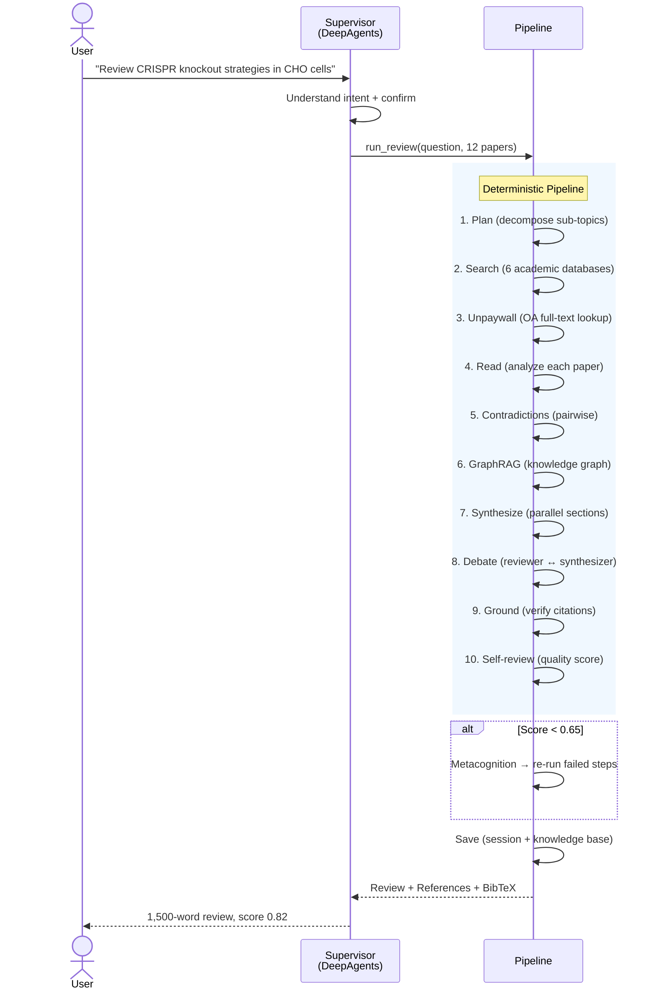
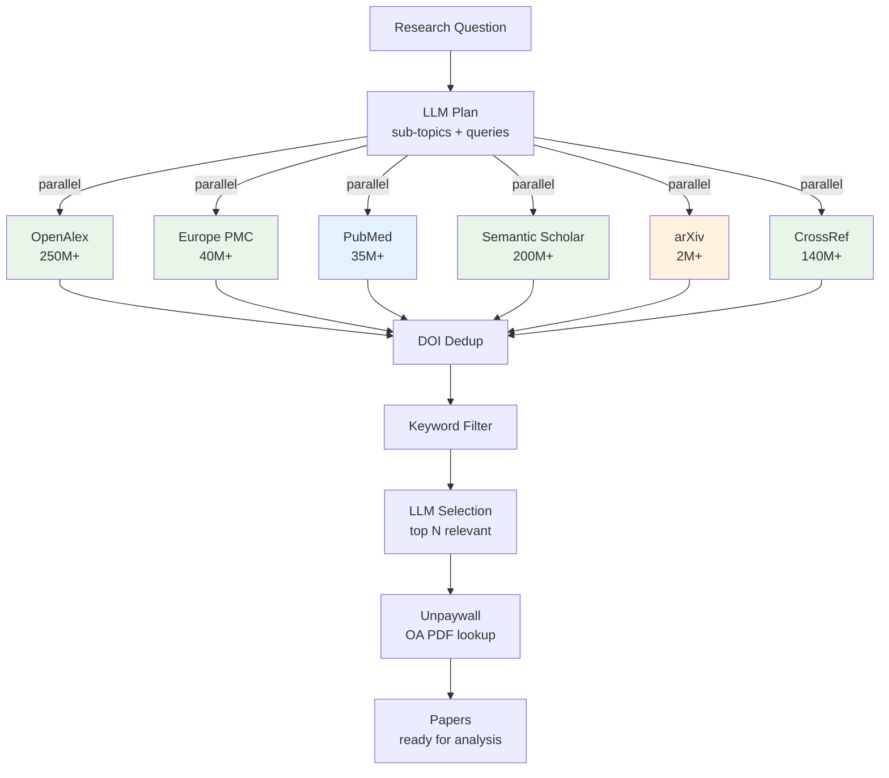

## Overview

LitScribe is an AI literature review engine that takes a research question and returns a 1,500–2,000 word review with verified citations, methodology comparison, research timeline, and BibTeX export — typically in about two minutes. Unlike chat-based tools that hallucinate citations, every `[@key]` reference is verified against the source paper. Unlike summarizers, the system detects contradictions across papers and presents them as critical analysis.

## What Makes It Different

Three contributions not present in any existing tool (ChatGPT, Elicit, PaperQA2, SurveyG):

1. **Contradiction-aware synthesis** — existing tools either generate reviews (ignoring contradictions) or detect contradictions (without writing reviews). LitScribe does both end-to-end: detect → inject into narrative → present as critical analysis.
2. **Metacognitive quality loop** — after self-review, the system evaluates *which* pipeline steps failed and autonomously re-runs them with adjusted strategy. Strategy decisions are persisted to a knowledge base for future reviews.
3. **Search-augmented refinement** — when users say "add a section about X", LitScribe searches for new papers on X first, analyzes them, then writes the section with real citations from the newly found papers — never hallucinating.

## Architecture

### DeepAgents Supervisor + Deterministic Pipeline

A natural-language supervisor (built on DeepAgents, 7 tools) interprets user intent, then dispatches a deterministic 10-step pipeline with a metacognitive quality loop:



Each numbered step is independently testable and persists to a SQLite knowledge base, so reviews can resume after interruption and downstream steps reuse upstream results across sessions.

### Six-Source Academic Search

The Search step (step 2 in the pipeline) fans out across six databases in parallel, then funnels results through dedup → keyword filter → LLM selection → open-access PDF lookup:



| Source | Coverage | Domain |
|--------|----------|--------|
| OpenAlex | 250M+ | All |
| Semantic Scholar | 200M+ | All |
| CrossRef | 140M+ | All (incl. Chinese) |
| Europe PMC | 40M+ | Life science |
| PubMed | 35M+ | Biomedical |
| arXiv | 2M+ | CS/Physics/Math |

Domain-aware routing auto-skips arXiv for biology/medicine; LLM-based selection filters irrelevant results after DOI deduplication.

## Features

### Citation Grounding
Every `[@key]` is verified against the source paper's actual findings. Unsupported claims are auto-detected and rewritten. Grounding accuracy: **83–100%** across benchmark domains.

### Contradiction Detection
Pairwise comparison surfaces opposing findings, which are then injected into the review as critical commentary:

> `[@cho2025]`: "FUT8 knockout had no negative effect on cell growth"
> `[@lin2020]`: "FUT8 knockout reduced cell viability by 40%"
> → classified as `opposing_conclusions` (major) → integrated into discussion

### Multi-Agent Debate
After synthesis, a reviewer agent critiques the draft → synthesizer revises → up to 2 rounds. Catches unsupported claims, missing perspectives, and weak synthesis.

### Local Paper Modes
- `litscribe draft my_review.md paper1.pdf paper2.pdf` — analyze your draft against references
- `litscribe outline *.pdf refs.bib` — "what review could I write from these?"
- `litscribe augment "CRISPR delivery" papers/*.pdf` — your papers + online search

### Natural Language Interface
The supervisor understands intent in English or Chinese and routes to the right tool:

```
"写个关于transformer的综述，3个主题"     → run_review (Chinese)
"加一段关于delivery methods"             → refine_review (searches new papers first)
"这篇综述适合什么人看"                   → assess_reading_level
```

### Cross-Lingual
Direct generation in target language (not post-translation), CJK-aware word counting, mismatch detection.

### Security
HMAC integrity on the knowledge base to detect data poisoning, prompt injection filter, XSS prevention, rate limiting, PDF URL domain whitelist, parameterized SQL.

## Review Output

Every generated review includes:

- Thematic analysis with `[@key]` Pandoc citations
- BibTeX-compatible reference list
- **Methodology Comparison** table across all papers
- **Research Timeline** (foundation → development → frontier)
- **Statistical Summary** — extracted p-values, effect sizes, sample sizes
- **Suggested Figures** — recommended visualizations with placement notes

## Interfaces

- **CLI** — 12 commands (`chat`, `review`, `draft`, `outline`, `augment`, `sessions`, `export`, `evaluate`, `serve`, `skills`, …)
- **Web UI + REST API** — 16 endpoints including SSE streaming for the review pipeline
- **Sessions + Knowledge Base** — persistent across reviews; supports diff-based refinement

## Benchmark

| Domain | Score | Papers | Words | Grounding | Time |
|--------|-------|--------|-------|-----------|------|
| Biology (CHO CRISPR) | **0.82** | 9 | 1,649 | 83% | 106 s |
| CS (LLM reasoning) | 0.72 | 12 | 1,535 | 63% | 121 s |
| Medicine (scRNA-seq TME) | 0.65 | 12 | 1,709 | 68% | 115 s |
| CS (transformer attention) | 0.55 | 12 | 1,643 | 62% | 153 s |
| Chemistry (sesquiterpene) | 0.55 | 3 | 1,338 | 100% | 103 s |

*Self-review score 0–1; grounding = % citations verified against source paper.*

## Technical Stack

| Component | Technology |
|-----------|------------|
| Language | Python 3.12+ |
| Supervisor | DeepAgents (7 tools) |
| LLM | Any OpenAI-compatible endpoint (DeepSeek, Qwen, Claude, …) |
| Knowledge Graph | NetworkX + Leiden community detection |
| Embeddings | sentence-transformers |
| PDF Processing | pymupdf4llm (default), marker-pdf (OCR) |
| Storage | SQLite (sessions, knowledge base with HMAC, vectors) |
| Backend | FastAPI + SSE streaming |
| Codebase | 86 files, 10,300 lines, 49 tests |

## Use Cases

- **Researchers** — rapid literature surveys; contradiction-aware systematic review preparation; gap identification
- **Graduate students** — thesis literature chapters; state-of-the-art mapping; seminal paper discovery
- **Industry R&D** — technical due diligence; competitive landscape from academic publications

## Limitations & Roadmap

- Requires API keys for cloud LLM functionality
- PDF extraction quality varies with document formatting
- Grounding accuracy degrades in highly technical domains (62–68% in some CS/medicine cases)

**Planned**: local LLM support (Ollama/MLX/vLLM); subscription system with daily digest; richer Web UI.

## Publication

arXiv preprint (NeurIPS-style template, 10 pages): case study, ablation, algorithm details, discussion. Draft available in the repository.

## GitHub Repository

[LitScribe](https://github.com/arnold117/LitScribe)

## Timeline

**Status**: Active development (January 2026 – present)
